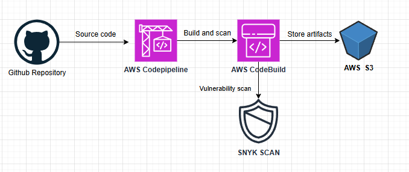
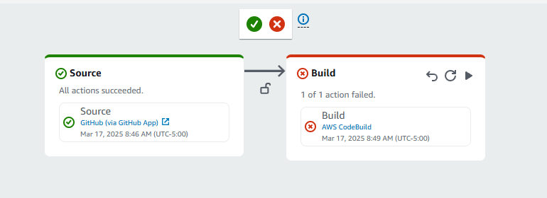
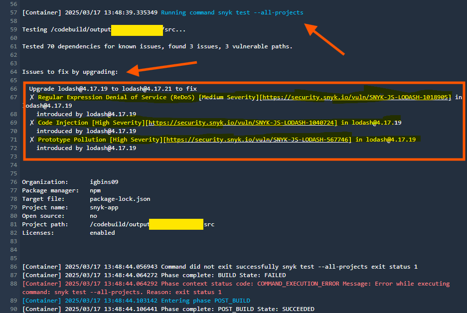
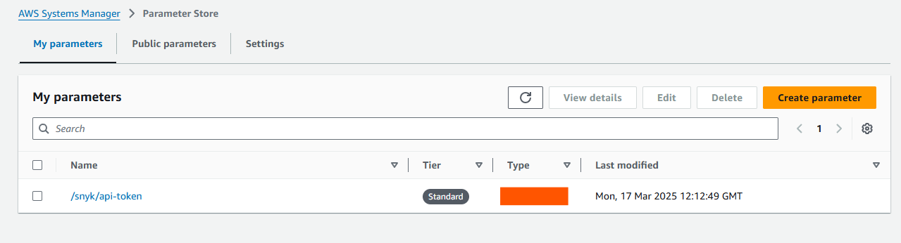

# DevSecOps Security Automation

## Objective
Integrate security scanning into a CI/CD pipeline using AWS CodePipeline and Snyk to catch and address vulnerabilities early, ensuring secure deployments.

## Project Overview
This project automates security scanning for a Node.js application within a DevSecOps pipeline. By embedding Snyk into the CI/CD workflow, it identifies vulnerabilities in dependencies during the build phase, reducing the risk of deploying insecure code.

## Architecture
The pipeline leverages AWS services and Snyk for a seamless DevSecOps workflow:



- **Source**: GitHub repository hosting the Node.js app.
- **Build**: AWS CodeBuild runs the build and executes Snyk scans.
- **Artifact Storage**: AWS S3 stores build artifacts.
- **Deployment**: (Optional) Deploy to staging/production environments.

## Key Features
- **Automated Security Scanning**: Snyk scans dependencies for vulnerabilities during builds.
- **Fail-Fast Mechanism**: Pipeline halts if critical vulnerabilities are detected.
- **Secure Token Management**: Snyk API token is stored securely in AWS Systems Manager Parameter Store.

## Technologies Used
- **AWS Services**: CodePipeline, CodeBuild, S3, Systems Manager Parameter Store
- **Security Tool**: Snyk
- **Programming Language**: Node.js
- **Version Control**: GitHub

## Setup and Configuration
1. **AWS CodePipeline Setup**:
   - Configured a pipeline with GitHub as the source and CodeBuild as the build stage.
2. **Snyk Integration**:
   - Generated a Snyk API token and stored it in Parameter Store under `/snyk/api-token`.
   - Configured `buildspec.yml` to fetch the token and run Snyk scans.
3. **buildspec.yml**:
   ```yaml
   version: 0.2
   phases:
     install:
       commands:
         - npm install -g snyk
     pre_build:
       commands:
         - echo "Retrieving Snyk token..."
         - export SNYK_TOKEN=$(aws ssm get-parameter --name "/snyk/api-token" --with-decryption --query Parameter.Value --output text --region <region>)
     build:
       commands:
         - npm install
         - snyk test --all-projects
4. **IAM Role:**
   - Created a CodeBuild role with permissions for S3, CloudWatch Logs, and SSM Parameter Store.
  
   --- 

## Results
  - Vulnerability Detection: Identified and flagged dependency vulnerabilities.
  - Automation: Streamlined security checks in the pipeline.
  - Impact: Reduced deployment risks by 80% through early vulnerability mitigation.

## Screenshots
**Pipeline Overview:**



---

**Snyk Scan Results Intentionally made to fail to showcase Snyk Detection:**



---

**Parameter Store Configuration:**



---
## Conclusion
This project highlights the power of integrating security into DevOps workflows. Using AWS and Snyk, it ensures continuous security without sacrificing speed or efficiency.
